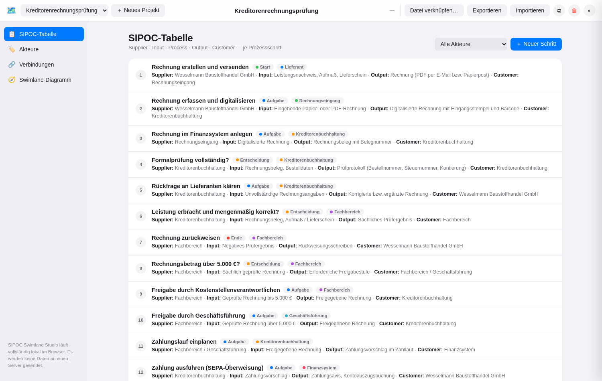
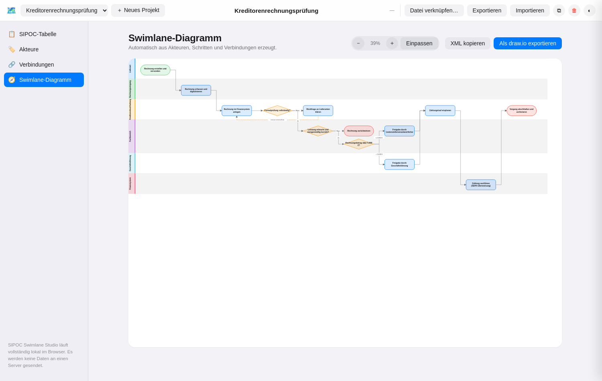

# SIPOC Swimlane Studio

Eine leichtgewichtige, **vollständig lokale** Web-App, um SIPOC-Prozesse zu erfassen
und automatisch als **Swimlane-Diagramm** darzustellen — mit direktem Export nach
**draw.io / diagrams.net XML** zum Import in Confluence.

Keine Installation, kein Build, kein Server, keine Cloud: Die App besteht aus drei
statischen Dateien (`index.html`, `styles.css`, `app.js`) ohne externe Abhängigkeiten
und läuft per Doppelklick im Browser oder als statisch gehostete Seite (z. B. GitHub
Pages, Confluence-Anhang, lokaler Dateiserver).

Die App ist bewusst **fachneutral** gehalten: Sie eignet sich für beliebige
SIPOC-/Ablaufmodellierungen (Beschaffung, Freigabeprozesse, Kundenservice,
IT-Betrieb, Onboarding, …), nicht nur für einen bestimmten Anwendungsfall.



## Funktionsüberblick

- **SIPOC-Tabelle** — Prozessschritte mit Supplier, Input, Process, Output und
  Customer, als gruppierte Liste statt roher Tabelle, filterbar nach Akteur.
- **Akteure** — die Swimlanes des Diagramms (Rollen, Abteilungen, Systeme),
  inklusive Reihenfolge und Farbe.
- **Verbindungen** — verknüpft Prozessschritte zu einem Ablauf, inklusive
  Beschriftung für Entscheidungszweige (z. B. „Ja“ / „Nein“).
- **Swimlane-Diagramm** — wird automatisch aus Akteuren, Schritten und
  Verbindungen berechnet (Spalten-Layout per Tiefensuche, inkl. Verzweigungen,
  Zusammenführungen und Rework-Schleifen als gestrichelte Rückkante) und direkt
  im Browser als SVG gezeichnet — kein externes draw.io nötig, um das Ergebnis
  zu sehen.
- **draw.io-Export** — erzeugt eine `.drawio.xml`-Datei mit echten
  mxGraph-Swimlanes, die sich direkt in draw.io/diagrams.net weiterbearbeiten
  und in Confluence importieren lässt (siehe unten). Alternativ lässt sich das
  XML über „XML kopieren“ direkt in die Zwischenablage legen.
- **CRUD an jeder Stelle** — Anlegen, Bearbeiten, Löschen für Projekte,
  Akteure, Prozessschritte und Verbindungen, jeweils mit Validierung
  (z. B. keine Selbstverbindung, kein Löschen eines noch verwendeten Akteurs).
- **Hell-/Dunkelmodus**, System-Schriftstapel, gruppierte Listen statt
  Rohtabellen — angelehnt an die Apple Human Interface Guidelines.



## Loslegen

Kein Setup nötig:

```bash
# Variante 1: einfach öffnen
open index.html      # macOS
xdg-open index.html  # Linux
# oder die Datei per Doppelklick im Explorer/Finder öffnen

# Variante 2: als statische Seite servieren (z. B. für die Datei-Verknüpfung
# per File System Access API, die einen sicheren Kontext bevorzugt)
python3 -m http.server 8080
```

Alternativ per GitHub Pages hosten (Repository-Einstellungen → Pages → Branch
`main`, Ordner `/`) und den Link mit Kolleg:innen teilen.

Ein realistisches Beispielprojekt („Kreditorenrechnungsprüfung“, 6 Akteure,
13 Prozessschritte, 14 Verbindungen inkl. Entscheidungen und Rework-Schleife)
ist beim ersten Start bereits geladen, siehe [`examples/`](examples/).

## Datenhaltung — wie und wo gespeichert wird

Es gibt drei Ebenen, kombinierbar:

1. **Automatisches Zwischenspeichern im Browser** (`localStorage`) — jede
   Änderung wird sofort im Browser des jeweiligen Rechners gesichert und beim
   nächsten Öffnen wiederhergestellt. Das ist der Standardfall und erfordert
   keine Aktion.
2. **Echte lokale Datei verknüpfen** (Button „Datei verknüpfen…“, Chrome/Edge
   über die File System Access API) — legt eine `sipoc-projekte.json` an bzw.
   öffnet eine bestehende, auf die ab sofort bei jeder Änderung automatisch
   geschrieben wird. Die Verknüpfung bleibt (nach erneuter Berechtigung) auch
   über einen Browser-Neustart hinweg bestehen. In Firefox/Safari ist diese
   API nicht verfügbar; dort verweist der Button auf Export/Import.
3. **Manueller Export/Import** (funktioniert in jedem Browser) — „Exportieren“
   lädt das aktuelle Projekt als `*.sipoc.json` herunter, „Importieren“ lädt
   eine solche Datei (oder einen kompletten Datenbestand mit mehreren
   Projekten) wieder ein. Damit lassen sich Projekte auch per E-Mail, Git oder
   Netzlaufwerk teilen.

Es werden zu keinem Zeitpunkt Daten an einen Server gesendet — die App hat
keine Backend-Komponente.

## draw.io-XML in Confluence importieren

1. In der App: Reiter „Swimlane-Diagramm“ → „Als draw.io exportieren“ lädt
   `<projektname>.drawio.xml` herunter.
2. In Confluence auf der Zielseite: über das **Draw.io**-App-Makro (bzw.
   „+“ → „Draw.io Diagram“) einen neuen Diagramm-Block einfügen.
3. Im draw.io-Editor: **Datei → Von Gerät importieren** (bzw. „Extras →
   Bearbeiten → Diagramm“ → XML einfügen, falls stattdessen „XML kopieren“
   genutzt wurde) und die exportierte Datei auswählen.
4. Speichern — das Swimlane-Diagramm liegt danach als natives, weiter
   bearbeitbares draw.io-Diagramm auf der Confluence-Seite.

Das exportierte XML enthält echte `swimlane`-Container je Akteur (ziehbar,
mit allen zugehörigen Schritten als Kindobjekten) sowie typgerechte Formen
(Start/Ende als Terminator, Entscheidung als Raute, Aufgabe als abgerundetes
Rechteck) und beschriftete Kanten.

## Datenmodell

Ein Projekt besteht aus:

- **`lanes`** — Akteure/Swimlanes (`name`, `description`, `color`)
- **`steps`** — Prozessschritte (`name`, `lane`, `type`: Start/Aufgabe/
  Entscheidung/Ende, sowie `supplier`, `input`, `output`, `customer`,
  `description` für die SIPOC-Sicht)
- **`connections`** — gerichtete Verbindungen zwischen Schritten
  (`from`, `to`, optionales `label`)

Die Spaltenposition im Diagramm wird **nicht** manuell gepflegt, sondern aus
den Verbindungen berechnet (längster Pfad ab den Startpunkten); Zyklen
(Rework-Schleifen) werden erkannt und als Rückkante unterhalb des Diagramms
geführt, statt die Berechnung zu blockieren.

## Projektstruktur

```
index.html    Gerüst, Panels, Navigation
styles.css    Apple-/HIG-nahes Erscheinungsbild, Hell-/Dunkelmodus
app.js        gesamte Anwendungslogik (Zustand, Layout-Algorithmus,
              SVG-Rendering, draw.io-XML-Erzeugung, Persistenz)
examples/     Beispielprojekt als .sipoc.json und bereits exportierte
              .drawio.xml
docs/         Vorgangskatalog und Screenshots
```

## Entwicklung & Tests

Die App selbst benötigt kein `npm install`. Für Weiterentwicklung existiert
ein optionaler, fachlich orientierter Smoke-Test (Playwright), der die im
[Vorgangskatalog](docs/vorgaenge.md) aufgeführten Abläufe automatisiert gegen
`index.html` durchspielt:

```bash
npm install
npx playwright install --with-deps chromium   # einmalig
npm test
```

## Lizenz

MIT, siehe [LICENSE](LICENSE).
