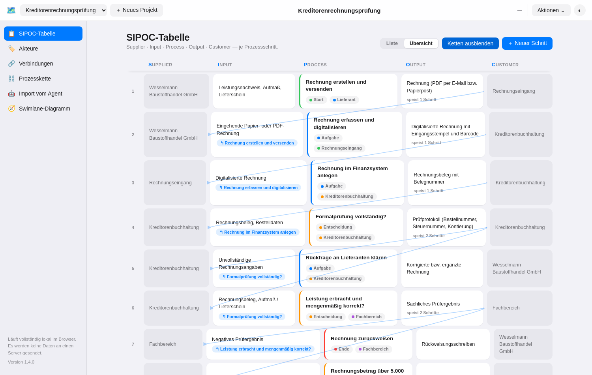
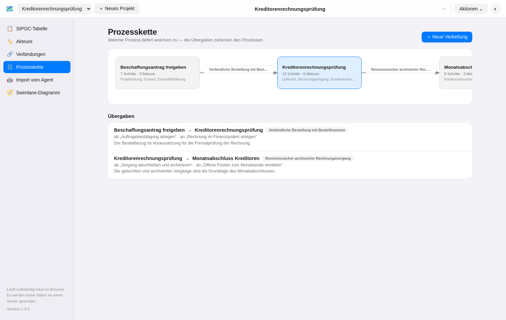
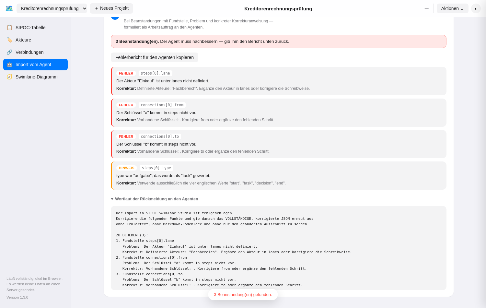

# SIPOC Swimlane Studio

Eine leichtgewichtige, **vollständig lokale** Web-App, um SIPOC-Prozesse zu erfassen
und automatisch als **Swimlane-Diagramm** darzustellen — mit direktem Export nach
**draw.io / diagrams.net XML** zum Import in Confluence.

**Direkt ausprobieren, ohne irgendetwas zu installieren:**
[datavoyage.github.io/sipoc-swimlane-studio](https://datavoyage.github.io/sipoc-swimlane-studio/)

Keine Installation, kein Build, kein Server, keine Cloud: Die App besteht aus drei
statischen Dateien (`index.html`, `styles.css`, `app.js`) ohne externe Abhängigkeiten
und läuft per Doppelklick im Browser oder als statisch gehostete Seite (z. B. GitHub
Pages, Confluence-Anhang, lokaler Dateiserver).

Die App ist bewusst **fachneutral** gehalten: Sie eignet sich für beliebige
SIPOC-/Ablaufmodellierungen (Beschaffung, Freigabeprozesse, Kundenservice,
IT-Betrieb, Onboarding, …), nicht nur für einen bestimmten Anwendungsfall.


## Funktionsüberblick

- **SIPOC-Tabelle** — Prozessschritte mit Supplier, Input, Process, Output und
  Customer, als gruppierte Liste statt roher Tabelle, filterbar nach Akteur.
- **Akteure** — die Swimlanes des Diagramms (Rollen, Abteilungen, Systeme),
  inklusive Reihenfolge und Farbe.
- **Verbindungen** — verknüpft Prozessschritte zu einem Ablauf, inklusive
  Beschriftung für Entscheidungszweige (z. B. „Ja“ / „Nein“).
- **SIPOC-Übersicht** — dieselben Daten als fünfspaltige Darstellung
  (Supplier · Input · Process · Output · Customer) mit sichtbarer
  Artefaktkette: Wo der Input eines Schritts aus dem Output eines anderen
  stammt, ist die Herkunft angegeben und lässt sich als Kurve einblenden.
- **Prozesskette** — Verkettung ganzer Prozesse untereinander samt Landkarte:
  welcher Prozess welchem zuarbeitet und über welches Artefakt.
- **Swimlane-Diagramm** — wird automatisch aus Akteuren, Schritten und
  Verbindungen berechnet (Spalten-Layout per Tiefensuche, inkl. Verzweigungen,
  Zusammenführungen und Rework-Schleifen als gestrichelte Rückkante) und direkt
  im Browser als SVG gezeichnet — kein externes draw.io nötig, um das Ergebnis
  zu sehen.
- **draw.io-Export** — erzeugt eine `.drawio.xml`-Datei mit echten
  mxGraph-Swimlanes, die sich direkt in draw.io/diagrams.net weiterbearbeiten
  und in Confluence importieren lässt (siehe unten). Alternativ lässt sich das
  XML über „XML kopieren“ direkt in die Zwischenablage legen.
- **CRUD an jeder Stelle** — Anlegen, Bearbeiten, Löschen für Projekte,
  Akteure, Prozessschritte und Verbindungen, jeweils mit Validierung
  (z. B. keine Selbstverbindung, kein Löschen eines noch verwendeten Akteurs).
- **Hell-/Dunkelmodus**, System-Schriftstapel, gruppierte Listen statt
  Rohtabellen — angelehnt an die Apple Human Interface Guidelines.


## Loslegen

Kein Setup nötig:

```bash
# Variante 1: einfach öffnen
open index.html      # macOS
xdg-open index.html  # Linux
# oder die Datei per Doppelklick im Explorer/Finder öffnen

# Variante 2: als statische Seite servieren (z. B. für die Datei-Verknüpfung
# per File System Access API, die einen sicheren Kontext bevorzugt)
python3 -m http.server 8080
```

Alternativ per GitHub Pages hosten (Repository-Einstellungen → Pages → Branch
`main`, Ordner `/`) und den Link mit Kolleg:innen teilen.

Beim ersten Start sind bereits drei aufeinander aufbauende Beispielprozesse
eines fiktiven Ingenieurbüros geladen — „Beschaffungsantrag freigeben“,
„Kreditorenrechnungsprüfung“ (6 Akteure, 13 Schritte, 14 Verbindungen inkl.
Entscheidungen und Rework-Schleife) und „Monatsabschluss Kreditoren“ —
inklusive Artefaktketten und der Verkettung untereinander, siehe
[`examples/`](examples/).

## Datenhaltung — wie und wo gespeichert wird

Es gibt drei Ebenen, kombinierbar:

1. **Automatisches Zwischenspeichern im Browser** (`localStorage`) — jede
   Änderung wird sofort im Browser des jeweiligen Rechners gesichert und beim
   nächsten Öffnen wiederhergestellt. Das ist der Standardfall und erfordert
   keine Aktion.
2. **Echte lokale Datei verknüpfen** (Button „Datei verknüpfen…“, Chrome/Edge
   über die File System Access API) — legt eine `sipoc-projekte.json` an bzw.
   öffnet eine bestehende, auf die ab sofort bei jeder Änderung automatisch
   geschrieben wird. Die Verknüpfung bleibt (nach erneuter Berechtigung) auch
   über einen Browser-Neustart hinweg bestehen. In Firefox/Safari ist diese
   API nicht verfügbar; dort verweist der Button auf Export/Import.
3. **Manueller Export/Import** (funktioniert in jedem Browser) — „Exportieren“
   lädt das aktuelle Projekt als `*.sipoc.json` herunter, „Importieren“ lädt
   eine solche Datei (oder einen kompletten Datenbestand mit mehreren
   Projekten) wieder ein. Damit lassen sich Projekte auch per E-Mail, Git oder
   Netzlaufwerk teilen.

Es werden zu keinem Zeitpunkt Daten an einen Server gesendet — die App hat
keine Backend-Komponente. Das gilt auch für die per GitHub Pages gehostete
Instanz: Sie liefert ausschließlich die statischen Dateien aus; jede Person,
die sie öffnet, hat ihren eigenen, unabhängigen Datenstand im eigenen
Browser bzw. in ihrer eigenen verknüpften Datei.

### Vom Beispielprojekt zum echten Prozess

Die App startet mit einem vollständig ausgefüllten Beispielprojekt, damit
sich alle Ansichten sofort ausprobieren lassen. Über **„Alle Daten
löschen“** im Kopfbereich lassen sich sämtliche Projekte inklusive Beispiel
in einem Schritt entfernen — danach steht ein einzelnes leeres Projekt
bereit, um direkt mit einem echten SIPOC-Prozess zu beginnen. Die Aktion
fragt vorher eine Bestätigung ab, ist aber nicht widerrufbar; sie wirkt auf
den Autosave in diesem Browser sowie auf eine ggf. verknüpfte lokale Datei.
Wer nur das Beispielprojekt loswerden, andere Projekte aber behalten will,
nutzt stattdessen „Projekt löschen“ (🗑) für das jeweils aktive Projekt.

## draw.io-XML in Confluence importieren

1. In der App: Reiter „Swimlane-Diagramm“ → „Als draw.io exportieren“ lädt
   `<projektname>.drawio.xml` herunter.
2. In Confluence auf der Zielseite: über das **Draw.io**-App-Makro (bzw.
   „+“ → „Draw.io Diagram“) einen neuen Diagramm-Block einfügen.
3. Im draw.io-Editor: **Datei → Von Gerät importieren** (bzw. „Extras →
   Bearbeiten → Diagramm“ → XML einfügen, falls stattdessen „XML kopieren“
   genutzt wurde) und die exportierte Datei auswählen.
4. Speichern — das Swimlane-Diagramm liegt danach als natives, weiter
   bearbeitbares draw.io-Diagramm auf der Confluence-Seite.

Das exportierte XML enthält echte `swimlane`-Container je Akteur (ziehbar,
mit allen zugehörigen Schritten als Kindobjekten) sowie typgerechte Formen
(Start/Ende als Terminator, Entscheidung als Raute, Aufgabe als abgerundetes
Rechteck) und beschriftete Kanten.

## Datenmodell

Ein Projekt besteht aus:

- **`lanes`** — Akteure/Swimlanes (`name`, `description`, `color`)
- **`steps`** — Prozessschritte (`name`, `lane`, `type`: Start/Aufgabe/
  Entscheidung/Ende, sowie `supplier`, `input`, `output`, `customer`,
  `description` für die SIPOC-Sicht) sowie `inputFrom` — die Schritte, aus
  deren Output sich der Input speist (Artefaktkette)
- **`connections`** — gerichtete Verbindungen zwischen Schritten
  (`from`, `to`, optionales `label`)

Projektübergreifend kommt **`processLinks`** hinzu: die Übergaben zwischen
ganzen Prozessen (`fromProject`, `toProject`, optional `fromStep`/`toStep`,
`artifact`, `description`). Sie sind Teil des Gesamt-Datenbestands, nicht des
einzelnen Projekt-Exports.

Die Spaltenposition im Diagramm wird **nicht** manuell gepflegt, sondern aus
den Verbindungen berechnet (längster Pfad ab den Startpunkten); Zyklen
(Rework-Schleifen) werden erkannt und als Rückkante unterhalb des Diagramms
geführt, statt die Berechnung zu blockieren.

## Projektstruktur

```
index.html    Gerüst, Panels, Navigation
styles.css    Apple-/HIG-nahes Erscheinungsbild, Hell-/Dunkelmodus
app.js        gesamte Anwendungslogik (Zustand, Layout-Algorithmus,
              SVG-Rendering, draw.io-XML-Erzeugung, Persistenz)
examples/     Beispielprojekt als .sipoc.json und bereits exportierte
              .drawio.xml
docs/         Vorgangskatalog und Screenshots
```

## SIPOC-Übersicht und Prozesskette

Die SIPOC-Tabelle lässt sich zwischen zwei Sichten umschalten: der **Liste**
zum Pflegen und der **Übersicht** zum Lesen. Die Übersicht stellt jede Zeile
als klassische SIPOC-Zeile dar — Supplier, Input, Process, Output, Customer
nebeneinander — und macht dabei sichtbar, wie die Zeilen zusammenhängen.



Dafür kann bei jedem Schritt hinterlegt werden, **aus wessen Output sich sein
Input speist** (Feld „Input stammt aus dem Output von“, Mehrfachauswahl). In
der Übersicht erscheint die Herkunft dann als Angabe in der Input-Karte, am
Output steht, wie viele Schritte er speist. Über „Ketten einblenden“ oder durch
Überfahren einer Zeile werden die Verbindungen als Kurven sichtbar; ein Klick
auf eine Herkunftsangabe springt zur Quelle. Im Ruhezustand bleiben die Kurven
ausgeblendet, damit die Ansicht ruhig bleibt.

Eine Ebene darüber steht die **Prozesskette**: Dort wird festgehalten, welcher
Prozess welchem zuarbeitet — mit dem übergebenen Artefakt und wahlweise dem
genauen Schritt, an dem die Übergabe stattfindet. Daraus entsteht eine
Landkarte der Prozesslandschaft; ein Klick auf eine Karte wechselt zum
jeweiligen Prozess.



Der mitgelieferte Beispielbestand zeigt beides an drei aufeinander aufbauenden
Prozessen eines fiktiven Ingenieurbüros: „Beschaffungsantrag freigeben“ →
„Kreditorenrechnungsprüfung“ → „Monatsabschluss Kreditoren“.

## Prozess von einem KI-Agenten erzeugen lassen

Der Reiter **„Import vom Agent“** ist für den Fall gedacht, dass ein KI-Agent
den Prozess ausarbeiten soll, statt ihn Schritt für Schritt von Hand zu
erfassen. Er führt durch drei Schritte:

1. **Prompt kopieren.** Die App enthält einen ausformulierten Prompt, der das
   erwartete Format vollständig beschreibt: Aufbau, jedes einzelne Feld mit
   Bedeutung und Pflichtangabe, die erlaubten Schritt-Typen, die inhaltlichen
   Regeln (genau ein Start, beschriftete Entscheidungszweige …) sowie ein
   vollständiges, gültiges Beispiel. Auch die Artefaktkette kann der Agent
   liefern (`inputFrom`). Er wird zusammen mit der eigentlichen
   Aufgabe an den Agenten gegeben.
2. **Antwort einfügen und prüfen.** Die Antwort des Agenten wird eingefügt und
   geprüft — es wird nichts blind importiert.
3. **Ergebnis.** Passt alles, lässt sich der Prozess als neues Projekt
   übernehmen und steht sofort als SIPOC-Tabelle und Swimlane-Diagramm bereit.



Der eigentliche Unterschied zum normalen Import liegt im Fehlerfall: Statt
einer pauschalen Meldung entsteht eine **Mängelliste, die als Arbeitsauftrag an
den Agenten formuliert ist** — je Beanstandung mit Fundstelle (z. B.
`steps[2].lane`), dem konkreten Problem und der auszuführenden Korrektur,
inklusive der jeweils gültigen Auswahl („Definierte Akteure: …“, „Vorhandene
Schlüssel: …“). Diese Rückmeldung lässt sich mit einem Klick kopieren und dem
Agenten zurückgeben; sie fordert ausdrücklich die vollständige, korrigierte
Ausgabe an.

Unterschieden wird dabei zwischen **Fehlern**, die den Import blockieren
(fehlende Pflichtangaben, unbekannte Akteure oder Schrittschlüssel, ungültige
Typen, Verbindungen ins Leere), und **Hinweisen**, die den Import nicht
aufhalten, aber zurückgemeldet werden: etwa ein in Markdown eingefasstes JSON,
Begleittext um die Antwort herum, deutsche statt englischer Typbezeichnungen
oder fachliche Auffälligkeiten wie ein fehlender Startpunkt, eine Entscheidung
ohne beschriftete Zweige oder unvollständig gefüllte SIPOC-Felder.

## App als lokale Datei mitnehmen

Über **Aktionen → „App als Datei herunterladen…“** erzeugt die App eine
einzelne, in sich geschlossene HTML-Datei (rund 95 KB): Programm, Gestaltung
und auf Wunsch der aktuelle Datenbestand sind darin eingebettet. Diese Datei
lässt sich per Doppelklick ohne Internetverbindung öffnen, auf einem
Netzlaufwerk ablegen, per E-Mail weitergeben oder als Confluence-Anhang
hinterlegen — es wird nichts installiert und nichts nachgeladen.

Im Dialog wird gewählt, was die Datei enthalten soll: die aktuellen Projekte,
das Beispielprojekt oder einen leeren Start. Das ist nötig, weil die
heruntergeladene Datei einen **eigenen, getrennten Datenspeicher** hat: Der
Browser trennt die Daten von `https://…github.io/…` und die einer lokalen
Datei strikt, sie sehen sich gegenseitig nicht. Wer online etwas erfasst hat
und lokal weiterarbeiten will, wählt daher „Aktuelle Daten übernehmen“.

Auch die heruntergeladene Datei kann sich selbst wieder weitergeben — der
Download-Eintrag funktioniert dort ebenso, ohne Internetverbindung.

## Entwicklung & Tests

Die App selbst benötigt kein `npm install`. Für Weiterentwicklung existiert
ein optionaler, fachlich orientierter Smoke-Test (Playwright), der die im
[Vorgangskatalog](docs/vorgaenge.md) aufgeführten Abläufe automatisiert gegen
`index.html` durchspielt:

```bash
npm install
npx playwright install --with-deps chromium   # einmalig
npm test
```

**Wichtig beim Ändern von `styles.css` oder `app.js`:** Die Versionsnummer in
`index.html` (`<meta name="app-version">`, `styles.css?v=…`, `app.js?v=…`) und
die Konstante `APP_VERSION` in `app.js` müssen gemeinsam erhöht werden.
GitHub Pages liefert alle Dateien mit `cache-control: max-age=600` aus, sodass
ein Browser sonst eine neue `index.html` mit einer alten `app.js` mischen kann
— dann sind Bedienelemente sichtbar, tun beim Klick aber nichts. Der
Versionsparameter erzwingt das Nachladen, und stimmen die beiden Werte doch
einmal nicht überein, blendet die App oben einen Hinweis zum Neuladen ein.

## Lizenz

MIT, siehe [LICENSE](LICENSE).
